# Flow Diagrams

This document provides visual representations of all major workflows in the AI Trip Planner application using Mermaid diagrams.

---

## Diagram 1: Overall System Architecture

**Purpose**: High-level view of system components and their interactions.

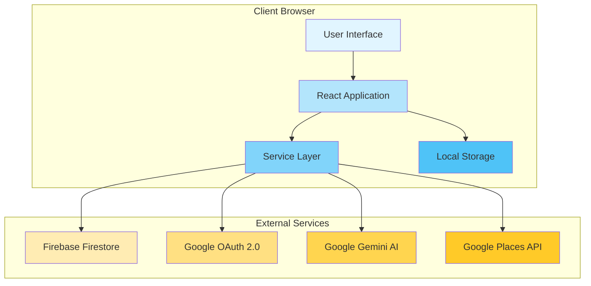

**Explanation**:
- **User Interface**: All React components and pages
- **React Application**: Component logic and state management
- **Service Layer**: API wrappers (GlobalApi, AIModal, firebaseConfig)
- **Local Storage**: Browser storage for user authentication
- **External Services**: Third-party APIs and databases

---

## Diagram 2: Application Initialization Flow

**Purpose**: Shows how the application boots up and initializes.

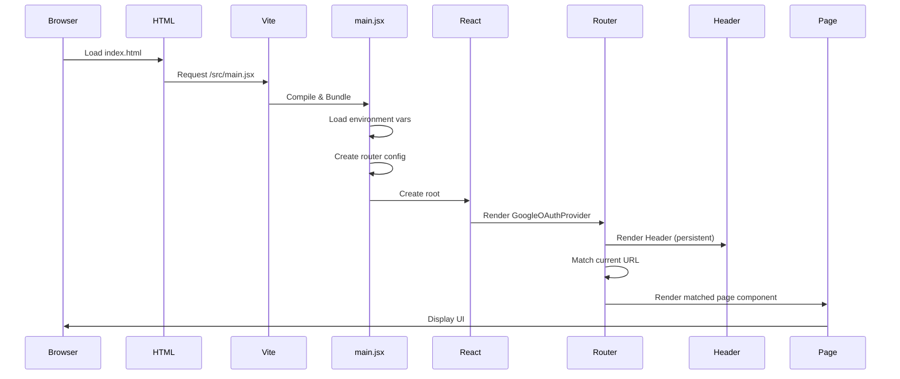

**Explanation**:
- Browser loads HTML, which triggers JavaScript loading
- Vite compiles and bundles the application
- main.jsx initializes React and sets up routing
- Header renders outside router (persistent across routes)
- Router matches URL and renders appropriate page

---

## Diagram 3: User Authentication Flow

**Purpose**: Complete OAuth 2.0 authentication workflow.

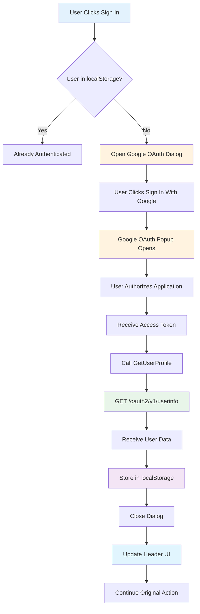

**Explanation**:
- System checks localStorage for existing user data
- If not found, opens Google OAuth dialog
- User authorizes, system receives access token
- Token used to fetch user profile from Google
- Profile stored in localStorage for persistence
- UI updates to reflect authenticated state

---

## Diagram 4: Trip Creation Flow (Complete)

**Purpose**: End-to-end trip generation process.

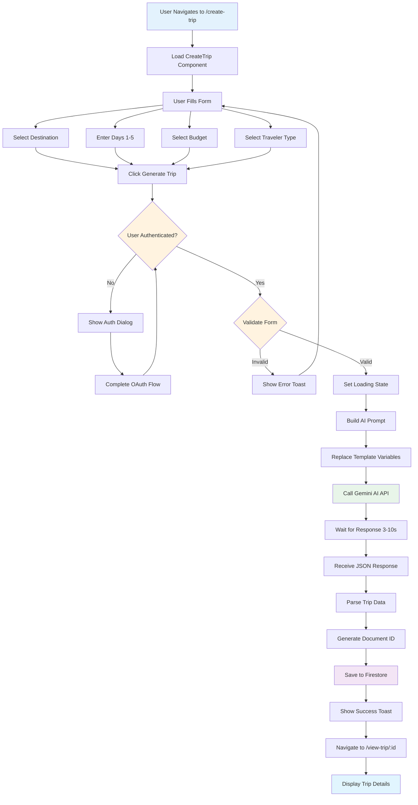

**Explanation**:
- User fills out four required form fields
- System validates authentication and form data
- AI prompt built with user selections
- Gemini AI generates trip itinerary
- Response saved to Firestore with unique ID
- User redirected to view their new trip

---

## Diagram 5: Trip Viewing Flow

**Purpose**: How trip details are loaded and displayed.

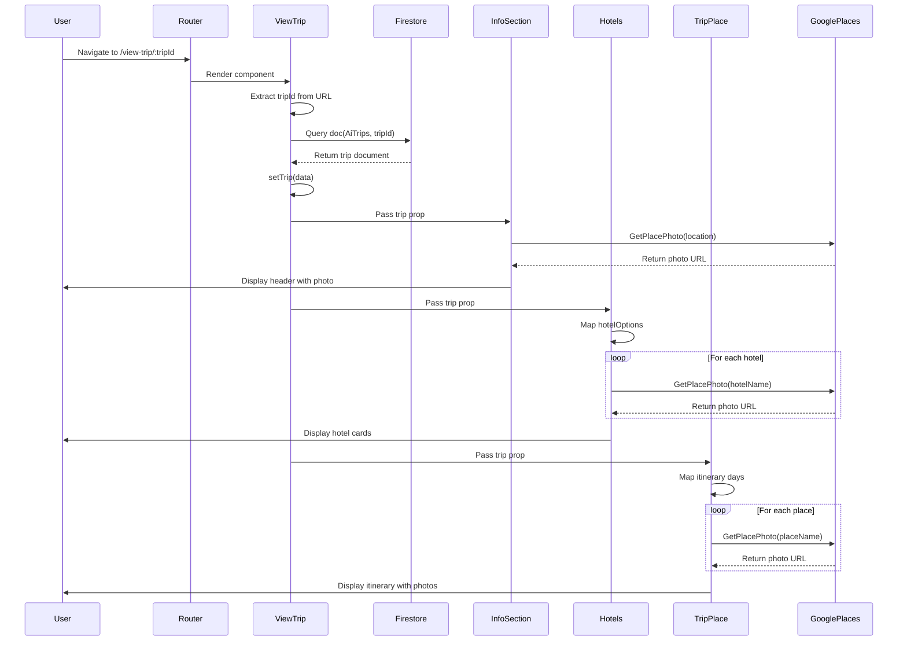

**Explanation**:
- URL parameter provides trip ID
- ViewTrip fetches trip data from Firestore
- Data passed to child components via props
- Each component independently fetches photos from Google Places
- Photos load asynchronously as they're fetched
- Complete trip displayed with all details

---

## Diagram 6: My Trips Dashboard Flow

**Purpose**: Loading and displaying user's trip history.

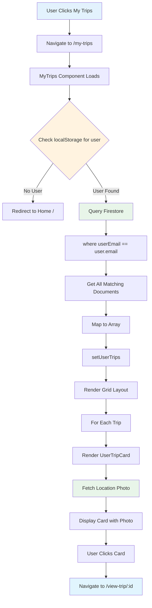

**Explanation**:
- User must be authenticated to view trips
- Firestore queried for all trips matching user's email
- Results mapped to state and rendered as grid
- Each card fetches its location photo independently
- Cards are clickable, navigating to full trip details

---

## Diagram 7: Photo Loading Pattern

**Purpose**: Common pattern used across multiple components for loading images.

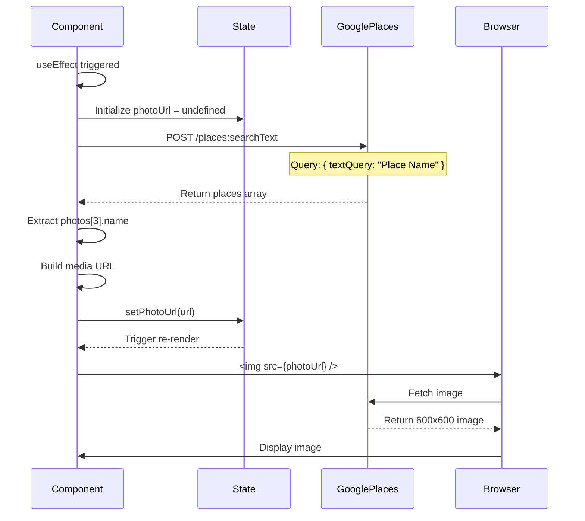

**Explanation**:
- Pattern used by InfoSection, HotelCardItem, PlaceCardItem, UserTripCard
- Component initializes with no photo
- useEffect triggers API call when data available
- Google Places API returns place details with photo references
- Photo reference converted to full media URL
- State update triggers re-render with image
- Browser loads actual image from URL

---

## Diagram 8: Data Flow Architecture

**Purpose**: Shows how data moves through the application layers.

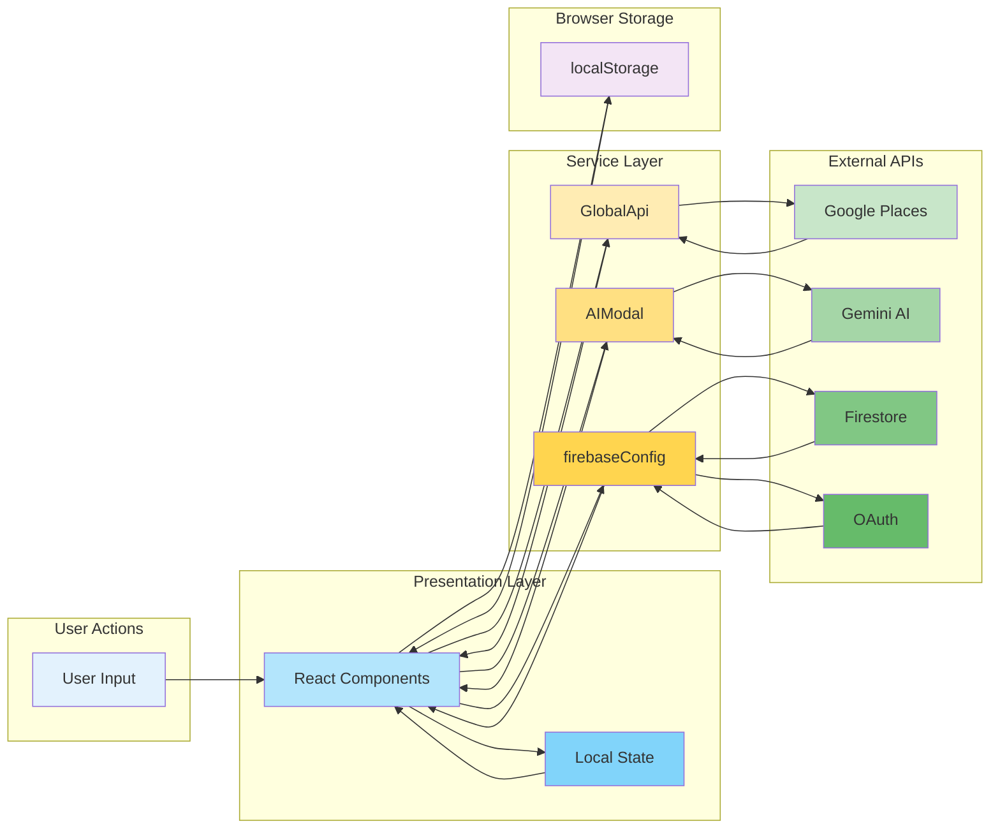

**Explanation**:
- User actions trigger component updates
- Components manage local state with hooks
- Components call service layer for external data
- Service layer abstracts API complexity
- External APIs return data to service layer
- Data flows back to components for rendering
- localStorage provides client-side persistence

---

## Diagram 9: Component Hierarchy

**Purpose**: Visual representation of component relationships.

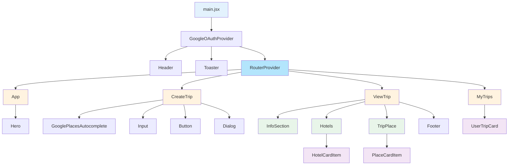

**Explanation**:
- main.jsx is the root, setting up providers and routing
- Router determines which page component renders
- Each page has its own set of child components
- Card components (HotelCardItem, PlaceCardItem, UserTripCard) are reusable
- UI primitives (Button, Input, Dialog) used throughout

---

## Diagram 10: State Management Flow

**Purpose**: How different types of state are managed.

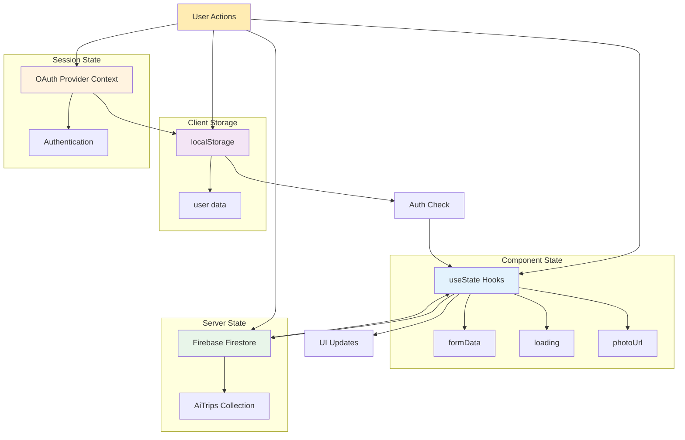

**Explanation**:
- **Component State**: Temporary UI state, form inputs, loading states
- **localStorage**: Persistent authentication across sessions
- **Firestore**: Server-side trip data storage
- **OAuth Context**: Authentication state provided by library
- Data flows between layers based on user actions

---

## Diagram 11: Error Handling Flow

**Purpose**: How errors are caught and displayed to users.

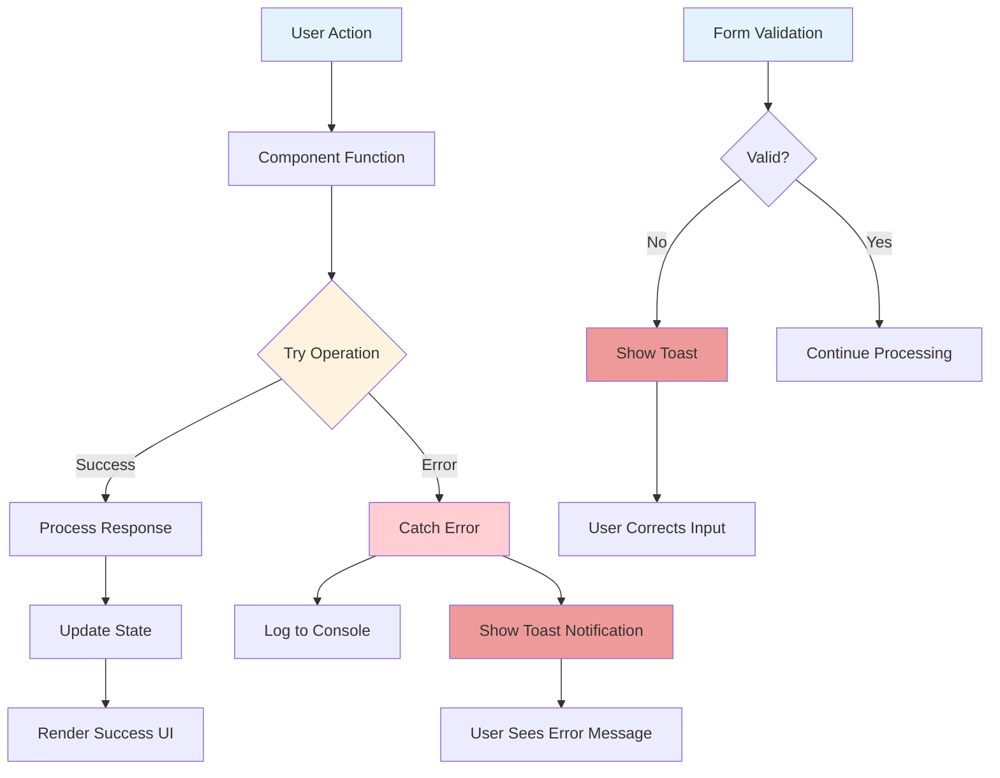

**Explanation**:
- Operations wrapped in try-catch or .then/.catch
- Errors logged to console for debugging
- Toast notifications inform users of errors
- Form validation prevents invalid submissions
- Validation errors shown via toast messages

---

## Diagram 12: Trip Creation State Machine

**Purpose**: State transitions during trip generation.

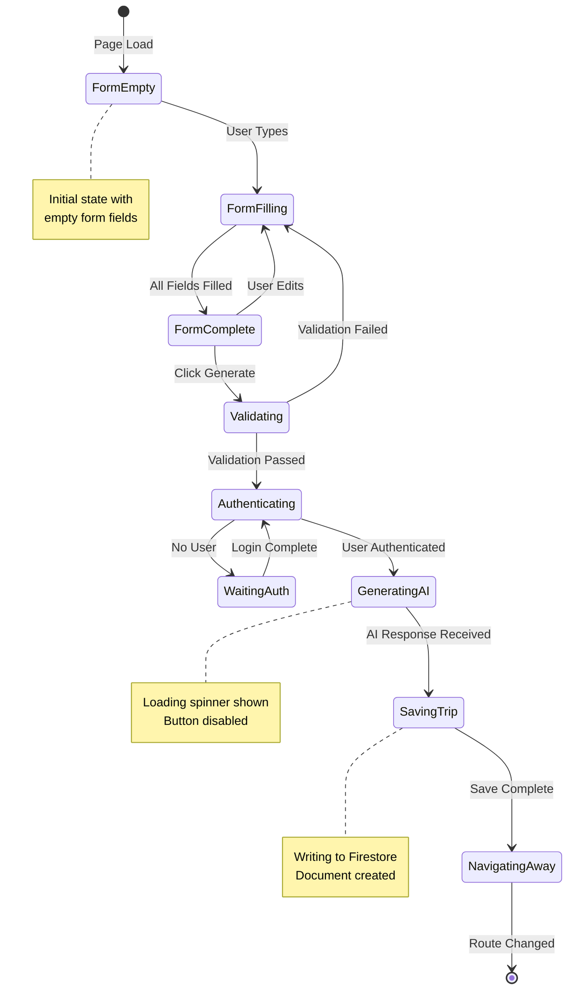

**Explanation**:
- Form starts empty, user fills fields
- Validation occurs on submission
- Authentication check required
- AI generation shows loading state
- Successful completion navigates to view page
- Each state has specific UI feedback

---

## Diagram 13: User Session Lifecycle

**Purpose**: How user authentication persists across visits.

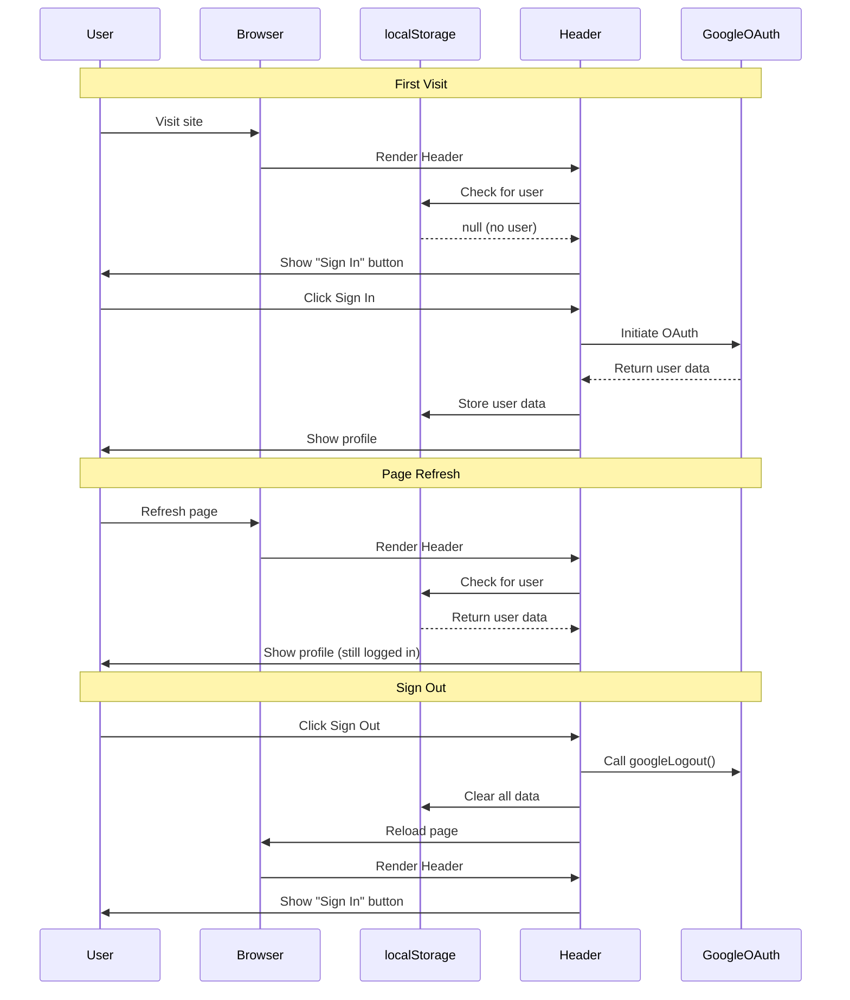

**Explanation**:
- First visit: No user in localStorage, shows sign in
- After OAuth: User data stored, persists in localStorage
- Page refresh: Header checks localStorage, finds user, stays logged in
- Sign out: Clears localStorage, reloads page, resets state
- No server-side session tracking

---

## Diagram 14: API Call Patterns

**Purpose**: Common patterns for external API interactions.

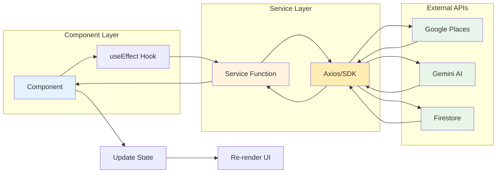

**Explanation**:
- Components use useEffect for side effects (API calls)
- Service layer abstracts API details
- Axios or SDK handles HTTP/network layer
- Responses flow back through layers
- State updates trigger UI re-renders
- Pattern consistent across all API interactions

---

## Summary

These diagrams illustrate:

1. **System Architecture**: Overall structure and external dependencies
2. **Initialization**: How the app boots up
3. **Authentication**: OAuth flow and session management
4. **Trip Creation**: End-to-end generation process
5. **Trip Viewing**: Data fetching and display
6. **Dashboard**: User's trip list
7. **Photo Loading**: Repeated pattern across components
8. **Data Flow**: How information moves through layers
9. **Component Hierarchy**: Parent-child relationships
10. **State Management**: Different types of state
11. **Error Handling**: User feedback mechanisms
12. **State Machine**: Trip creation states
13. **Session Lifecycle**: Authentication persistence
14. **API Patterns**: Common communication patterns

These visual representations complement the textual documentation and provide quick reference for understanding system flows.
